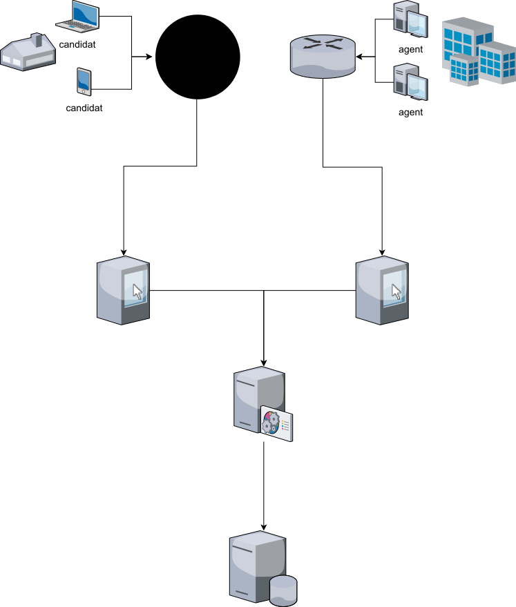
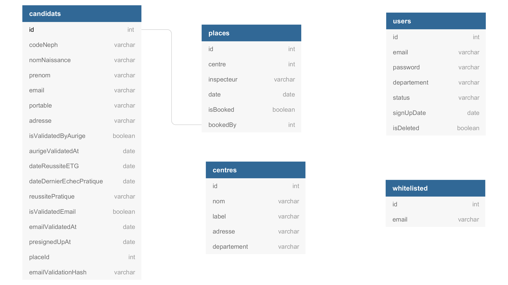
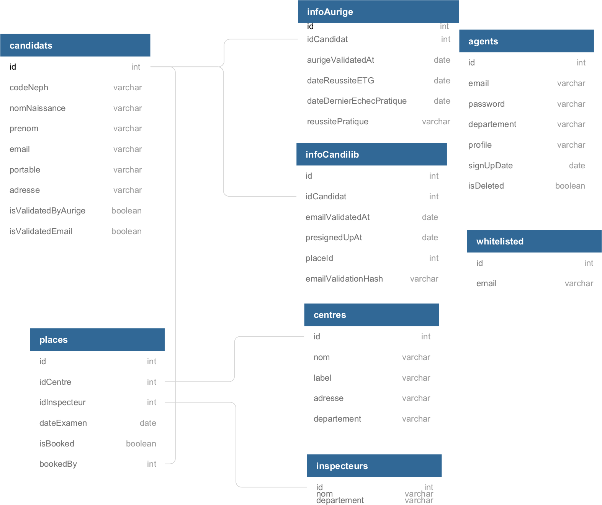

# Architecture globale

## Principes

L'application Candilib s'articule autour de 3 parties :

* ``frontal`` qui fournit les applications en fonctions des profils des utilisateurs
* ``back`` qui dispose d'un ensemble d'api utilisée par les applications web et par les composants de gestion
* ``persistance des données`` qui persiste les informations nécessaires au fonctionnement de Candilib

L'application s'adresse aux candidats et aux agents qui impliqués dans la gestion des examens pratiques sur l'ensemble du territoir. La partie ``frontal`` est séparée en deux parties distinctes pour chacune de ces populations. De plus, chaque composant dispose de ces propres routes vers la partie ``back`` qui assure le filtrage en fonction de l'origine des requêtes.

La partie ``back`` assure le traitement applicatif de Candilib. Elle est constituée d'un composant qui met à disposition via des API les différents services applicatifs. Ces derniers sont dédiés à un ``frontal`` et aux composants internes de gestion.

La partie ``persistance des données`` garantie :

* la disponibilité
* la fiabilité
* l'intégrité

Le schéma ci-dessous synthétise ces principes d'architecture.

## Modèle de données

Le modèle de données actuel est modélisé dans le schéma ci-dessous. Il comprends une structure `candidats` qui comprte l'ensemble des données relatives à la personne, sa situation adminitrative et son statut dans l'application candilib. Le lien entre une place d'examen et un lieu n'est pas formalisé et relève de la convention d'utiliser la même dénomination pour les champs `centre` de la structure `places` et `nom` de la structure `centres`.

Le schéma suivant est une proposition de structuration des données pour la version 2 de candilib. Elle ressort les données de la situation administrative du candidat ainsi que sa gestion au sein de l'application.

De même les données relatives aux `places` d'examen sont liées formellement avec les structures externes des `centres` et des `inspecteurs`.

La structure `utilisateurs` est renommée en `agents` et l'information de `status` est renommée en `profile`.